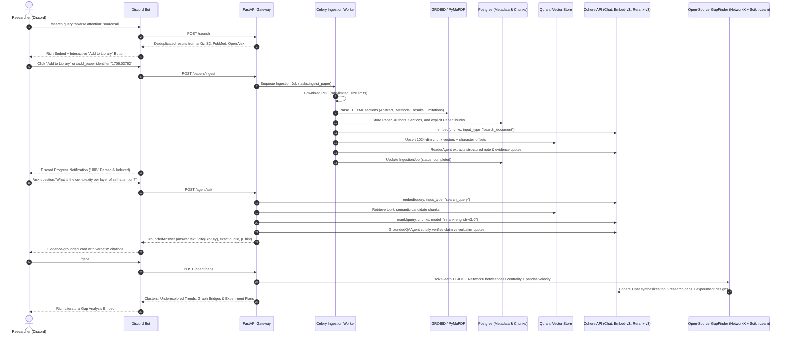

# 🏛️ HERMES_RESEARCH_AGENT

[](https://www.python.org/downloads/)
[](https://cohere.com/)
[](https://fastapi.tiangolo.com/)
[](https://qdrant.tech/)
[](https://grobid.readthedocs.io/)
[](https://networkx.org/)
[](https://scikit-learn.org/)
[](https://discordpy.readthedocs.io/)
[](https://docker.com)

**HERMES_RESEARCH_AGENT** is an academic-first, production-ready research assistant engineered for a 2-researcher Discord laboratory. It supports up to 6 months of continuous scientific research: multi-engine literature discovery, dual-layer parsing (GROBID TEI-XML + PyMuPDF), chunk-level semantic vector indexing in Qdrant, long-term project memory, multi-agent synthesis, **open-source research gap finding**, and **strictly evidence-grounded RAG** powered exclusively by Cohere models.

---

## 🎯 Hard Architectural Guarantees

1. **Exclusively Powered by Cohere**:
   - **Chat & Reasoning**: Cohere Command family (default: `command-r-plus`, configurable via `COHERE_CHAT_MODEL`).
   - **Embeddings**: Cohere Embed v3 (default: `embed-english-v3.0`, 1024 dimensions, `input_type="search_document"` & `"search_query"`).
   - **Reranking**: Cohere Rerank v3 (default: `rerank-english-v3.0`, top-N reranking over candidate chunks).
   - Absolutely no OpenAI, OpenRouter, or third-party proprietary router dependencies.
2. **Open-Source Research Gap Finder (`src/gap_finder/`)**:
   - Pure open-source analysis using `scikit-learn`, `networkx`, `pandas`, and `numpy`.
   - Discovers topic clusters, underexplored rising publication trends, betweenness centrality bridge gaps between weakly-connected communities, and missing empirical signals.
3. **Evidence-Grounded RAG with Strict Citations**:
   - Every answer to `/ask` is strictly grounded in passages retrieved from your library.
   - Outputs include `\cite{BibKey}`, exact verbatim quote spans, section names, and page numbers.
   - If evidence is absent, Hermes explicitly refuses to hallucinate, states the evidence gap, and proposes targeted search queries.
4. **Chunk-Level Indexing**:
   - Explicit `paper_chunks` records in PostgreSQL (tracking `char_start`, `char_end`, `page_number`, `chunk_index`).
   - Vectors indexed in Qdrant with 1024-dimensional Cohere v3 embeddings and Cohere v3 reranking.
5. **Dual-Layer Scientific Extraction**:
   - Layer 1 (Primary): **GROBID** Docker container for academic TEI XML hierarchy.
   - Layer 2 (Fallback): Heuristic **PyMuPDF** (`fitz`) section parser.
6. **2-Person Security Allowlist**:
   - The Discord bot enforces strict allowlist authentication via `USER1_ID` and `USER2_ID`. Unrecognized users cannot issue commands.
7. **Universal Execution Modes**:
   - **Docker Compose Mode**: 8 microservices (`postgres`, `qdrant`, `redis`, `minio`, `grobid`, `api`, `worker`, `discord-bot`).
   - **Local Mode (Docker daemon stopped)**: Runs directly on Python 3.12 with SQLite and embedded Qdrant with deterministic offline vector fallback.

---

## 🏗️ System Architecture & Data Flow



---

## ⚡ Quickstart with Docker Compose (Production / VM)

Deploy on any Linux VM or local Docker setup in 3 minutes:

```bash
# 1. Clone repository
git clone https://github.com/your-org/hermes-research-agent.git
cd hermes-research-agent

# 2. Configure environment
cp .env.example .env
nano .env   # Provide DISCORD_BOT_TOKEN, USER1_ID, USER2_ID, and COHERE_API_KEY

# 3. Launch the full 8-service stack
docker compose up -d --build

# 4. View container status
docker compose ps
```

Services started:
- `postgres` (Port 5432)
- `qdrant` (Port 6333, Dashboard at `/dashboard`)
- `redis` (Port 6379)
- `minio` (Port 9000, Console at `:9001`)
- `grobid` (Port 8070)
- `api` (FastAPI at `:8000/docs`)
- `worker` (Celery background queue)
- `discord-bot` (Discord.py client)

---

## 🔬 Open-Source Literature Gap Finding (`src/gap_finder/`)

Hermes avoids proprietary, closed-source gap finder APIs. Instead, it utilizes standard, auditable open-source tooling:

1. **Topic Modeling & Semantic Clustering**:
   - `scikit-learn` TF-IDF vectorization and $K$-means clustering extract top domain keywords and group related papers into coherent topic spaces.
2. **Citation & Reference Graph Analysis**:
   - `networkx` constructs literature similarity and citation graphs.
   - Computes **Betweenness Centrality** to identify "structural bridges"—interdisciplinary papers connecting otherwise isolated communities.
3. **Publication Velocity & Trend Analysis**:
   - `pandas` and `numpy` analyze paper counts across publication years ($2017 \dots 2026$).
   - Flags **underexplored frontiers**: clusters with high recency ratio (recent papers) but low overall volume in the library.
4. **Missing Signal Extraction**:
   - Gathers reported benchmark datasets, evaluation metrics, and author-acknowledged limitations from structured reading notes.
5. **Cohere Synthesis**:
   - Cohere's Command model consumes the open-source analytical summaries and formulates concrete, testable research gaps, experiment proposals, and follow-up search queries.

---

## 💻 Local Development Without Docker (Daemon Stopped)

When Docker is offline, all components run smoothly on bare Python 3.12:

### 1. Install Dependencies
```bash
pip install -e ".[dev]"
```

### 2. Initialize Database & Run Tests
```bash
python scripts/init_db.py
python -m pytest tests/unit -v
```

### 3. Run CLI Utilities Directly
```bash
# 1. Search literature across arXiv, S2, PubMed, OpenAlex
python scripts/test_search.py "selective state space models"

# 2. Ingest and parse a paper into local database
python scripts/ingest_paper.py "1706.03762"

# 3. Ask question against library chunks
python scripts/ask_library.py "How does self-attention operate?"
```

### 4. Start Local API & Discord Bot
```bash
# Terminal 1: API
python -m uvicorn src.api.main:app --port 8000 --reload

# Terminal 2: Discord Bot
python -m src.discord_bot.bot
```

---

## 💬 Discord Slash Command Reference

| Command | Arguments | Description |
| :--- | :--- | :--- |
| `/project` | `action: create \| switch \| truth`, `name` | Create projects, switch active context, or display shared truth & decision logs. |
| `/search` | `query`, `source: all \| arxiv \| semanticscholar \| pubmed`, `limit` | Live literature search with interactive pagination and `[📥 Add to Library]` button. |
| `/add_paper` | `identifier` (arXiv ID, DOI, URL, or PMID) | Ingests paper, downloads PDF, extracts TEI sections, indexes chunks, and notifies Discord. |
| `/library` | `action: recent \| find`, `query` | Browse indexed papers in library or search by keyword. |
| `/summarize` | `paper: BibKey`, `style: short \| deep` | Displays structured Reading Mode card (problem, idea, methods, results, limitations, quotes). |
| `/ask` | `question`, `scope: library` | Evidence-grounded QA citing exact `\cite{BibKey}`, quote spans, and section/page hints. |
| `/compare` | `papers: key1,key2`, `criteria` | Generates cross-paper comparison matrix and surfaces research gaps. |
| `/gaps` | `project_id` (optional) | **Open-source Gap Finder**: Top 5 research gaps, underexplored trends, graph community bridges, and experiments. |
| `/outline` | `topic`, `target: related work \| methods` | Produces structured academic manuscript outline with citation anchors. |
| `/draft` | `section`, `topic` | Drafts a formal manuscript section with strict BibTeX citations. |
| `/tasks` | `action: add \| list \| done`, `title` | Collaborative laboratory task board. |
| `/scratchpad`| `action: view \| add \| clear`, `note` | Private per-researcher scratchpad for ideation before sharing. |

---

## ⚙️ Environment Variables (`.env`)

| Variable | Recommended Default | Description |
| :--- | :--- | :--- |
| `COHERE_API_KEY` | `your_cohere_key` | Cohere platform API key |
| `COHERE_CHAT_MODEL` | `command-r-plus` | Cohere Chat & Reasoning model (e.g. `command-r-plus`, `command-r`) |
| `COHERE_EMBED_MODEL` | `embed-english-v3.0` | Cohere Dense Embedding model (1024 dimensions) |
| `COHERE_RERANK_MODEL` | `rerank-english-v3.0` | Cohere Cross-Encoder Rerank model |
| `COHERE_EMBED_DIM` | `1024` | Vector dimensionality for Qdrant collection |
| `USE_RERANKER` | `true` | Enable Cohere rerank-v3 on retrieved chunks |
| `DISCORD_BOT_TOKEN` | `your_discord_token` | Discord Bot application token |
| `USER1_ID`, `USER2_ID` | `123456789012345678` | Allowed Discord Snowflake user IDs |
| `DATABASE_URL` | `postgresql+asyncpg://...` | PostgreSQL async connection string |
| `QDRANT_URL` | `http://qdrant:6333` | Qdrant vector database URL |
| `REDIS_URL` | `redis://redis:6379/0` | Redis broker and cache URL |
| `MINIO_ENDPOINT` | `minio:9000` | S3-compatible MinIO object store |
| `GROBID_URL` | `http://grobid:8070` | GROBID TEI XML parser service |

---

## 🔧 Troubleshooting

### Problem: Discord bot displays "Access Denied"
- **Cause**: Your Discord user ID is not in `USER1_ID` or `USER2_ID` in `.env`.
- **Solution**: In Discord, enable *Developer Mode* (Settings -> Advanced -> Developer Mode). Right-click your profile and select *Copy User ID*. Paste into `.env` and restart the bot.

### Problem: Docker daemon is stopped or cannot connect
- **Cause**: Docker Desktop is not running or Linux daemon is stopped.
- **Solution**: The Hermes codebase detects this and automatically switches to the embedded local Qdrant engine and SQLite database. Run `python -m pytest tests/unit -v` and run the FastAPI server locally (`uvicorn src.api.main:app --port 8000`).

### Problem: Semantic Scholar returns status 429
- **Cause**: Public rate limits on api.semanticscholar.org.
- **Solution**: Hermes automatically falls back to arXiv and OpenAlex. For dedicated S2 bandwidth, add `SEMANTIC_SCHOLAR_API_KEY` in `.env`.

---

## 🧪 Automated Testing

Hermes includes a comprehensive unit test suite:
```bash
python -m pytest tests/unit -v
```

16 passing tests validate:
- BibTeX key standardization (`[Author][Year][Keyword]`)
- arXiv XML feed parsing & redirection handling
- Semantic Scholar and OpenAlex model conversions
- GROBID TEI XML section parsing
- Academic semantic chunker character offsets (`char_start`, `char_end`)
- Grounded QA with verbatim citation passages & unsupported claim fallbacks
- Database models: `PaperChunk`, `IngestionJob`, `Project`, and `UserScratchpad`
- Multi-agent state transitions (Planner, Writer, Critic with Cohere)
- Open-Source GapFinder topic clustering, trend analysis, graph bridges, and signal extraction
