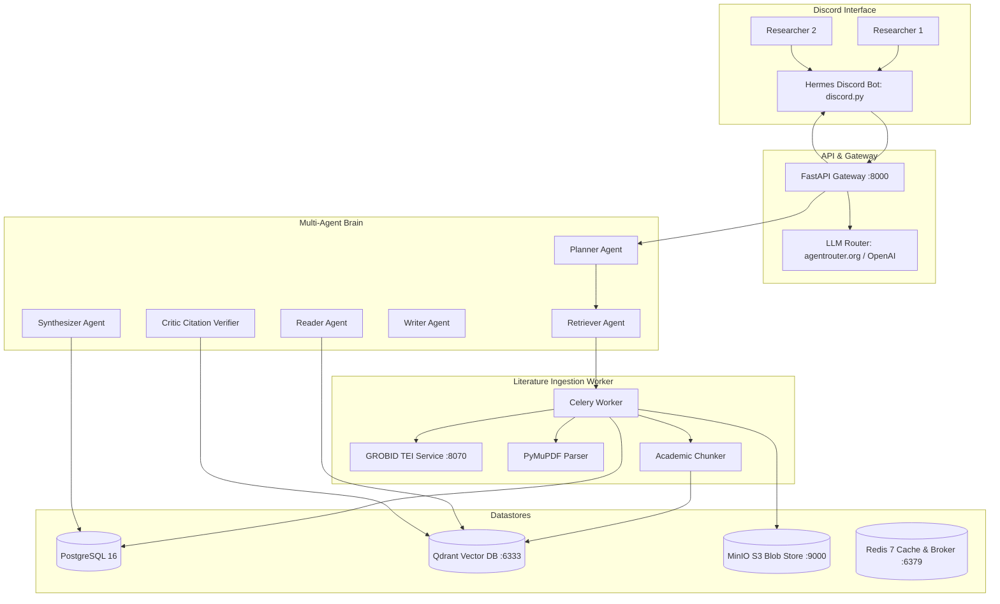

# 🏛️ Hermes Research Agent

[](https://www.python.org/downloads/)
[](https://fastapi.tiangolo.com/)
[](https://qdrant.tech/)
[](https://grobid.readthedocs.io/)
[](https://discordpy.readthedocs.io/)
[](https://docker.com)

**Hermes** is an academic-first, collaborative research assistant engineered for a 2-researcher Discord laboratory. It automates literature discovery, structured scientific paper extraction (GROBID TEI-XML + PyMuPDF), semantic passage vector indexing (Qdrant), long-term project memory, multi-agent synthesis (LangGraph), and strict BibTeX citation verification.

---

## 🌟 Key Capabilities

### 1. Academic Literature Pipeline
- **Multi-Engine Search**: Live parallel querying across **arXiv**, **Semantic Scholar**, **PubMed (NCBI Entrez)**, and **Crossref**.
- **Automated Ingestion**: Downloads PDFs, parses full-text into hierarchical sections (`Abstract`, `Introduction`, `Methods`, `Results`, `Limitations`), extracts tables and quotes, and saves raw artifacts in MinIO (S3).
- **Dual-Layer Extraction**:
  - *Layer 1 (Gold Standard)*: **GROBID** Docker service for scientific structure, formula recognition, and TEI XML parsing.
  - *Layer 2 (Resilient Fallback)*: Heuristic **PyMuPDF** (`fitz`) layout and section parser.
- **Passage-Grounded Citations**: Splits sections with semantic boundary awareness into Qdrant vector points, ensuring every statement can be traced to exact page numbers and passages.

### 2. Multi-Agent "Brain"
- **Planner Agent**: Decomposes complex research questions into sub-questions, boolean query variations, inclusion/exclusion criteria, and reading lists.
- **Retriever Agent**: Multi-source querying, cross-engine deduplication by DOI and normalized title, and recency/citation ranking.
- **Reader / Extractor Agent**: Generates structured notes covering:
  - *Research Problem*
  - *Key Novel Idea*
  - *Methodology Details*
  - *Datasets & Evaluation Metrics*
  - *Empirical Findings vs. Baselines*
  - *Assumptions & Limitations*
  - *Reproducibility Details*
  - *Verbatim Evidence Quotes*
- **Synthesizer Agent**: Builds cross-paper comparison matrices, maps consensus vs. controversies, surfaces research gaps, and proposes concrete experiments with ablations.
- **Writer Agent**: Produces academic paper outlines and draft sections formatted with formal `\cite{BibKey}` citation keys.
- **Critic & Citation Verifier Agent**: "Show me the evidence" verification engine that matches claims against indexed paper passages and flags ungrounded assertions.

### 3. Long-Term Memory (6-Month Continuity)
- **Project Memory**: Stores active research questions, formal hypotheses, and timestamped decision logs.
- **Paper Memory**: Searchable library of indexed papers, structured notes, and vector representations.
- **2-Researcher Discord Scratchpad**: Private per-user scratchpads for spontaneous thoughts with one-command promotion to shared project truth.

---

## 🏗️ System Architecture



---

## 📂 Repository Structure

```
hermes_research_agent/
├── docker-compose.yml              # Complete 8-service containerized stack
├── Dockerfile                      # Production Docker container image
├── pyproject.toml                  # Python packaging & dependencies
├── alembic.ini                     # Database migration configuration
├── .env.example                    # Environment variable template
├── scripts/
│   ├── init_db.py                  # Database schema initialization script
│   └── test_literature_search.py   # CLI search test utility
├── src/
│   ├── config/
│   │   └── settings.py             # Pydantic Settings management
│   ├── common/
│   │   ├── exceptions.py           # Custom exception hierarchy
│   │   ├── logging.py              # Rich logging utility
│   │   └── models.py               # Shared Pydantic exchange models
│   ├── connectors/                 # Literature connectors
│   │   ├── base.py                 # Abstract connector & BibTeX generator
│   │   ├── arxiv_connector.py      # arXiv API connector
│   │   ├── semantic_scholar.py     # Semantic Scholar Graph connector
│   │   ├── pubmed_connector.py     # PubMed Entrez connector
│   │   └── crossref_connector.py   # Crossref DOI & BibTeX connector
│   ├── ingestion/                  # PDF parsing & chunking
│   │   ├── downloader.py           # Async PDF fetcher
│   │   ├── grobid_parser.py        # GROBID TEI XML scientific parser
│   │   ├── pymupdf_parser.py       # PyMuPDF layout fallback parser
│   │   └── chunker.py              # Semantic academic chunker
│   ├── storage/                    # Database, Vectors & Storage
│   │   ├── database.py             # Async SQLAlchemy 2.0 engine
│   │   ├── models.py               # Relational ORM models (Paper, Note, Task, etc.)
│   │   ├── vector_store.py         # Qdrant client & passage embeddings
│   │   └── object_store.py         # MinIO / S3 object store
│   ├── agent/                      # Multi-Agent Brain
│   │   ├── llm_client.py           # OpenAI-compatible LLM client
│   │   ├── state.py                # AgentState data model
│   │   ├── graph.py                # ResearchBrain orchestrator
│   │   └── roles/
│   │       ├── planner.py          # Research planner
│   │       ├── retriever.py        # Multi-engine retriever & ranker
│   │       ├── reader.py           # Structured note extractor
│   │       ├── synthesizer.py      # Cross-paper comparative matrix
│   │       ├── writer.py           # Academic drafter with \cite{} keys
│   │       └── critic.py           # Evidence passage verifier
│   ├── memory/                     # Long-term memory
│   │   ├── project_memory.py       # Shared truth & decision logs
│   │   └── user_scratchpad.py      # Per-user isolated scratchpads
│   ├── api/                        # FastAPI REST service
│   │   ├── main.py                 # App entry point
│   │   └── routes/                 # REST endpoints (papers, projects, agent)
│   ├── worker/                     # Celery background worker
│   │   ├── tasks.py                # Paper ingestion & extraction task
│   │   └── worker.py               # Celery app
│   └── discord_bot/                # Discord interface
│       ├── bot.py                  # Bot entry point & 2-user auth guard
│       ├── ui/
│       │   ├── embeds.py           # Rich academic embeds
│       │   └── views.py            # Pagination & ingestion buttons
│       └── cogs/
│           └── research_cogs.py    # Slash command implementations
└── tests/
    └── unit/                       # Complete automated unit test suite
```

---

## 🚀 Quick Start & Deployment

### Option A: Complete Docker Compose Deployment (Production)

1. **Clone the repository**:
   ```bash
   git clone https://github.com/your-org/hermes-research-agent.git
   cd hermes-research-agent
   ```

2. **Configure environment variables**:
   ```bash
   cp .env.example .env
   # Populate DISCORD_BOT_TOKEN, LLM_API_KEY (agentrouter.org or OpenAI), etc.
   ```

3. **Start all 8 services**:
   ```bash
   docker compose up -d --build
   ```

4. **Verify container health**:
   ```bash
   docker compose ps
   ```

Services started:
- `postgres` (Port 5432)
- `qdrant` (Port 6333)
- `redis` (Port 6379)
- `minio` (Port 9000, Console 9001)
- `grobid` (Port 8070)
- `api` (Port 8000)
- `worker` (Celery background worker)
- `discord-bot` (Discord bot client)

---

### Option B: Local Development & Offline Mode

You can run individual components locally without Docker using the embedded Qdrant fallback and SQLite database:

1. **Install dependencies**:
   ```bash
   pip install -e ".[dev]"
   ```

2. **Initialize local database**:
   ```bash
   python scripts/init_db.py
   ```

3. **Run automated test suite**:
   ```bash
   python -m pytest tests/unit -v
   ```

4. **Test Literature Search from CLI**:
   ```bash
   python scripts/test_literature_search.py "transformers for time series"
   ```

5. **Start FastAPI development server**:
   ```bash
   python -m uvicorn src.api.main:app --reload --port 8000
   ```

6. **Start Discord Bot**:
   ```bash
   python -m src.discord_bot.bot
   ```

---

## 💬 Discord Slash Command Reference

| Slash Command | Parameters | Description |
| :--- | :--- | :--- |
| `/search` | `query`, `source`, `limit` | Live literature search across arXiv, S2, and PubMed with pagination and interactive "+ Add to Library" button. |
| `/add_paper` | `identifier` | Ingests a paper by arXiv ID, DOI, URL, or PMID; runs GROBID/PyMuPDF; indexes vectors in Qdrant; and extracts structured notes. |
| `/summarize` | `paper` | Displays Reading Mode card showing core problem, novelty, methods, results, limitations, and evidence quotes. |
| `/verify` | `claim`, `paper` | Critic Citation Verifier: verifies whether a specific claim is supported by passages in the cited paper. |
| `/project` | `action`, `name` | Manages research projects and displays shared truth (research question, decision history, active tasks). |
| `/scratchpad` | `action`, `note` | Private per-researcher scratchpad for drafting ideas before publishing to shared truth. |

---

## 🧪 Testing & Quality Assurance

Run the comprehensive unit test suite:
```bash
python -m pytest tests/unit -v
```
All 10 tests validate:
- BibTeX key generation with academic naming conventions
- arXiv Atom XML feed parsing & redirection handling
- Semantic Scholar Academic Graph model conversions
- GROBID TEI XML section extraction
- Academic semantic chunking with heading preservation
- Async database models, sessions, and project memory
- Per-user scratchpad lifecycle
- Planner, Writer, and Critic multi-agent role workflows
